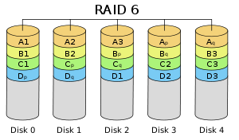
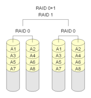

摘录：https://blog.csdn.net/ensp1/article/details/81318135

# RAID
Redundant Array of Inexpensive Disks -> Redundant Array of Independent Disks

---

## 一、RAID-冗余磁盘阵列 概述

由于当时大容量磁盘比较昂贵，RAID的基本思想是将多个容量较小、相对廉价的磁盘进行有机结合，从而以较低的成本获得与昂贵大容量磁盘相当的容量、性能、可靠性。随着磁盘成本和价格不断降低、RAID可以使用大部分的磁盘，RAID咨询委员会决定用‘独立’代替‘廉价’，于是RAID变成了独立磁盘冗余阵列，实际技术并未改变。

1. RAID这种设计思想作为**高性能、高可靠的存储技术**，已经得到了非常广泛的运用。

2. RAID主要利用**数据条带、镜像和数据校验**来获取高性能、可靠性、容错能力和拓展性

根据运用或组合运用这三种技术的策略和架构，可以把RAID分为不同的等级

**目前业界公认标准为RAID0~RAID5，除了RAID2外的四个等级被定为工业标准，在实际应用领域中使用最多的RAID等级是RAID0、RAID1、RAID3、RAID5、RAID6和RAID10。**

**从实现的角度看，RAID主要分为软RAID、硬RAID以及软硬混合RAID三种：**

- 软RAID所有功能均由操作系统和CPU完成，没有独立的RAID控制/处理芯片和I/O处理芯片，效率最低；

- 硬RAID配备了专门的RAID控制/处理芯片和I/O处理芯片以及阵列缓冲，不占CPU资源，但是成本高。

- 软硬混合RAID具有RAID控制/处理芯片，但缺乏I/O处理芯片，需要CPU和驱动程序来完成，性能与成本皆介于软RAID和硬RAID之间。

*RAID每一个等级代表一种实现方法和技术，等级之间并无高低之分。在实际应用中，应当根据用户的数据应用特点，综合考虑可用性、性能和成本来选择合适的RAID的等级，以及具体的实现方式。*

---

## 二、基本原理

**RAID（Redundant Array of Independent Disks）**

**简单地说，RAID是由多个独立的高性能磁盘驱动器组成的磁盘子系统，从而提供比单个磁盘更高的存储性能和数据冗余的技术。**

RAID是一类多磁盘管理技术，其向主机环境提供了成本适中、数据可靠性高的高性能存储。SNIA对RAID的定义：一种磁盘阵列，部分物理存储空间用来记录保存在剩余空间上的用户数据的冗余信息。当其中某一个磁盘或访问路径发生故障时，冗余信息可用来重建用户数据。磁盘条带化虽然与RAID定义不符，通常还是称为RAID（基RAID0）。

RAID的初衷是为大型服务器提供高端的存储功能和冗余的数据安全。在整个系统中，RAID被看作是由两个或更多磁盘组成的存储空间，通过并发地在多个磁盘上读取数据来提高存储系统的I/O性能。大多数RAID等级具有完备的数据校验、纠正措施，从而提高系统的容错性，甚至镜像方式，大大增强系统的可靠性，Redundant也由此而来。

RAID的两个关键目标是提高数据可靠性和I/O性能。磁盘阵列中，数据分散在多个磁盘中，然而对于计算机系统来说，就像一个单独的磁盘。通过把相同数据同时写入到多块磁盘（典型地如镜像），或者将计算的校验数据写入阵列中来获得冗余能力，当单块磁盘出现故障时可以保证不会导致数据丢失。

**RAID中主要有三个关键概念和技术：镜像（Mirroring）、数据条带（Data Stripping）和数据校验（Data parity）**

- 镜像：将数据复制到多个磁盘，一方面可以提高可靠性，另一方面可并发从两个或多个副本读取数据来提高读性能。对于RAID而言，采用镜像技术，将会在阵列中产生两个完全相同的数据副本，分布在两个不同的磁盘驱动组上。镜像提供了完全的数据冗余能力，当一个数据副本失效不可用时，外部系统仍可正常访问另一副本，不会对应用系统运行和性能产生影响。而且，镜像不需要额外的计算和校验，故障修复非常快，直接复制即可。镜像技术可以从多个副本进行并发读取数据，提供更高的读I/O性能，但不能并行写数据，写多个副本会导致一定的I/O性能降低。

*&emsp;&emsp;镜像技术提供了非常高的数据安全，其代价也是非常昂贵的，需要至少双倍的存储空间。高成本限制理律广泛应用，主要应用于需要保护至关重要数据的场合。另外，镜像通过“拆分”能获得特定时间点上的数据快照，从而可以实现一种备份窗口几乎为零的数据备份技术。*

- 数据条带：将数据分片保存在多个不同的磁盘，多个数据分片共同组成一个完整数据副本。这与镜像的多副本是不同的，它通常基于性能考虑。数据条带具有更高的并发粒度，当访问数据时，可以同时对于不同磁盘上的数据进行读写操作，从而获得非常可观的I/O性能提升。

*&emsp;&emsp;磁盘存储性能的瓶颈在于磁头寻道定位，它是一种慢速运动，无法与高速的CPU匹配。再者，单个磁盘驱动器性能存在物理极限，I/O性能非常有限。RAID由多块磁盘组成，数据条带技术将数据以块的方式分布存储在多个磁盘中，从而可以对数据进行并发处理。这样写入和读取数据就可以在多个磁盘上同时进行，并发产生非常高的聚合I/O,有效提高了整体I/O性能，而且具有良好的线性扩展性。这对大的数据处理效果尤其显著，如果不分块，数据只能按顺序存储在磁盘阵列的磁盘上，需要时再按顺序读取，而通过条带技术可以获得数倍于顺序存储的I/O性能。*

*&emsp;&emsp;数据条带技术的分块大小选择非常关键。条带粒度可以是一个字节至几KB大小，分块越小，并行处理力就越强，数据存取速度就越高，但同时就会增加块存取的随机性和块寻址时间。实际运用中，要根据数据特征和业务需求来选择合适的分块大小，在数据存取随机性和并发处理能力之间进行平衡，以争取尽可能高的整体性能。*

**&emsp;&emsp;数据条带是基于I/O性能而提出来的，也就是说它只关注性能，而对数据可靠性，可用性没有任何改善。实际上，其中任何一个数据条带损坏都会导致整个数据不可用，反而会提高数据丢失的概率。**

- 数据校验：利用冗余数据进行数据错误检测和修复，冗余数据通常采用海明码、异或操作算法等来技术获得。利用校验功能，可以很大程度提高磁盘阵列的可靠性、鲁捧（robust）性和容错能力。不过数据校验需从多出读取数据并进行计算对比，会影响系统性能。

*&emsp;&emsp;镜像具有高安全性、高读写性，但冗余开销太昂贵。数据条带通过并发性来大幅提高性能，然而对数据安全性、可靠性未做考虑。数据校验是一种冗余技术，它用校验数据来提供数据的安全，可以检测数据错误，并在条件允许的情况下进行数据重构。相对于镜像，数据校验大幅度缩减了冗余开销，用较小的代价换取了极佳的数据完整性和可靠性。数据条带提升性能，数据校验保证数据安全性，RAID不同等级往往同时结合使用这两种技术。*

*&emsp;&emsp;采用数据校验时，RAID要在写入数据同时进行校验计算，并将得到的校验数据存储在RAID成员磁盘中。校验数据可以集中保存在某个成员磁盘，或者分散存储在多个不同磁盘中，甚至校验数据也可以分块，不同RAID等级实现各不相同。当其中一部分数据出错时，就可以对剩余数据和校验数据进行反校验计算重建丢失的数据。*

***磁盘阵列会减少全体磁盘的总可用存储空间，牺牲空间换取更高的可靠性和性能***

---

### RAID的优点

>（1）大容量

       这是RAID一个显然的优势，它扩大了磁盘的容量，由多个磁盘组成的RAID系统具有海量的存储空间。现在单个磁盘的容量能达到TB级别，这样RAID的存储容量就可以达到PB级，大多数的存储需求都可以满足。一般来说，由于RAID算法需要一定的冗余开销，RAID的可用容量一般要小于所有成员磁盘的总容量。通常，RAID容量利用率在50%~90%之间。

>（2）高性能

        RAID的高性能受益于数据条带化技术。单个磁盘的I/O性能受到接口、带宽等计算机技术的限制，性能往往很有限，容易成为系统性能的瓶颈。通过数据带条化，RAID将数据I/O分布到各成员磁盘上，从而获得比单个磁盘成倍增长的聚合I/O性能。

>（3）可靠性

        可用性和可靠性是RAID的另一个重要特征。从理论上看，由多个磁盘组成的RAID系统在可靠性方面应该比单个磁盘要差，这里有个隐含假定：单个成员磁盘出现故障会导致整个RAID系统不可用。RAID采用镜像和数据校验等数据冗余技术解决了这个问题。镜像是最为原始的冗余技术，把某组磁盘驱动器上的数据完全复制到另一组磁盘上，保证总有数据副本可用。比起镜像50%的冗余开销，数据校验要小很多，它利用校验冗余信息对数据进行校验和纠错。RAID冗余技术大幅提升数据可用性和可靠性，保证了若干磁盘出错时，不会导致数据的丢失，不影响系统的连续运行。

>（4）可管理性

        实际上，RAID只是一种虚拟化技术，它对多个物理磁盘驱动器虚拟构成一个大容量的逻辑驱动器，对于外部主机系统来说，RAID是一个单一的、快速可靠的大容量磁盘驱动器。这样，用户就可以在这个虚拟驱动器上来组织和存储应用系统数据，从用户应用角度上看，可使存储系统简单易用，管理也比较便利。由于RAID内部完成了大量的存储管理工作，管理员只需要管理单个虚拟驱动器，可以节省大量的管理工作。RAID可以动态增减磁盘驱动器，可自动进行数据校验和数据重建。

---

## 三、RAID等级

### 3.1 JBOD
 **JBOD**（Just a Bunch of Disks）不是标准的RAID等级。它通常用来表示一个没有控制软件提供协调控制的磁盘集合。JBOD将多个物理磁盘串联起来，提供一个巨大的逻辑磁盘。

JBOD（如图1）的数据存放机制是由第一块磁盘开始顺序往后存储，当前磁盘存储空间用完后，再依次往后面的磁盘存储数据。JBOD存储性能完全等同于单块磁盘，而且也不提供数据安全保护。它只是简单提供一种扩展存储空间的机制，JBOD可用存储用来等于所有成员磁盘的存储空间之和。目前JBOD常指磁盘柜，而不论其是否提供RAID功能。

### 3.2 标准RAID等级

&emsp;&emsp; SNIA、Berkeley等组织机构把RAID0、RAID1、RAID2、RAID3、RAID4、RAID5、RAID6 七个等级定为标准的RAID等级。标准等级是最基本的RAID配置集合，单独或综合利用数据条带、镜像和数据校验技术。标准RAID可以组合，即RAID组合等级，满足对性能、安全性、可靠性要求更高的存储应用需求。

1. **RAID0**

    RAID0是一种简单的、无数据校验的数据条带化技术。实际上不算真正的RAID，因为它并不提供任何形式的冗余策略。RAID0将所在磁盘条带化后组成大容量的存储空，将数据分散存储在所有磁盘中，以独立访问方式实现多块磁盘的并读访问。由于可以并发执行I/O操作，总线带宽得到充分利用。再加上不需要进行数据校验，RAID0的性能在所有RAID等级中是最高的。理论上讲，一个由n块磁盘组成的RAID0，它的读写性能是单个磁盘性能的n倍，但由于总线带宽等多种因素的限制，实际的性能提升低于理论值。

    

    RAID0具有低成本、高读写性能、100%的高存储空间利用率等优点，但是它不提供数据冗余保护，一旦数据损坏，将无法恢复。因此，RAID0一般适用于对性能要求严格但对数据安全性和可靠性要求不高的应用，如视频、音频存储、临时数据缓存空间等。

2. **RAID1**

    RAID1称为镜像，它将数据完全一致地分别写到工作磁盘和镜像磁盘，它的磁盘空间利用率为50%。RAID1在数据写入时，响应时间会有所影响，但是读数据的时候没有影响。RAID1提供了最佳的数据保护，一旦工作磁盘发生故障，系统自动从镜像磁盘读取数据，不会影响用户工作。工作原理图如下

    RAID1与RAID0刚好相反，是为了增强数据安全性是两块磁盘数据呈现完全镜像，从而达到安全性好、技术简单、管理方便。RAID1 拥有完全容错的能力，但实现成本高。RAID1应用对于顺序读写性能要求高以及对数据保护极为重视的应用，如对邮件系统的数据保护。

3. **RAID2**

    RAID2 称为纠错海明码磁盘矩阵，其设计思想是利用海明码实现数据校验冗余。海明码是一种在原始数据中加入若干校验码来进行错误检测和纠正的编码技术，其中第2n位是校验码，其他位置是数据码。因此在RAID2中，数据按位存储，每块磁盘存储一位数据编码，磁盘数量取决于所设定的数据存储宽度，可由用户设定。图4所示的为数据宽度为4的RAID2，它需要4块数据磁盘和3块校验磁盘。如果 是64位数据宽度，则需要64块数据磁盘和7块校验磁盘。可见，RAID2的数据宽度越大，存储空间利用率越高，但同时需要的磁盘数量也越多。

    海明码自身具备纠错能力，因此RAID2可以在数据发生错误的情况下纠正错误，保证数据的安全性。它的数据传输性能相当高，设计复杂性要低于后面介绍的RAID3、RAID4和RAID5,。

    但是，海明码的数据冗余开销太大，而且RAID2的数据输出性能受阵列中最慢磁盘驱动器的限制。再者，海明码是按位运算，RAID2数据重建非常耗时。由于这些显著的缺陷，再加上大部分磁盘驱动器本身都具备了纠错功能，因此RAID2在实际中很少应用，没有形成商业产品，目前主流存储磁盘阵列均不提供RAID2支持。

4. **RAID3**

    RAID3 是使用专用校验盘的并行访问阵列，它采用一个专用的磁盘作为校验盘，其余磁盘作为数据盘，数据按位和字节的方式交叉存储到各个数据盘中。RAID3至少需要三块磁盘，不同磁盘上同一带区的数据作XOR校验，校验值写入校验盘中。RAID3完好时读性能与RAID0完全一致，并行从多个磁盘条带读取数据，性能非常高，同时还提供了数据容错能力。向RAID3写入数据时，必须计算与所有同条带的校验值，并将新校验值写入校验盘中。一次写操作包含了写数据块、读取同条带的数据块、计算校验值、写入校验值等多个操作，系统开销非常大，性能较低。

    如果RAID3中某一磁盘出现故障，不会影响数据读取，可以借助校验数据和其他完好数据来重建数据。假如所要读取的数据块正好位于失效磁盘，则系统需要读取所有同一条带的数据块，并根据校验值重建丢失的数据，系统性能将受到影响。当故障磁盘被更换后，系统按相同的方式重建故障盘中的数据至新磁盘。

    RAID3只需要一个校验盘，阵列的存储空间利用率高，再加上并行访问的特征，能够为高带宽的大量读写提供高性能，适用于大容量数据的顺序访问应用，如影像处理、流媒体服务等。目前，RAID5算法不断改进，在大数据量读取时能够模拟RAID3，而且RAID3出现坏盘时性能会大幅下降，因此常适用RAID5代替RAID3来运行具有持续性、高带宽、大量读写特征的应用。

5. **RAID4**

    RAID4与RAID3的原理大致相同，区别在于条带化的方式不同。RAID4按照块的方式来组织数据，写操作只涉及当前数据盘和校验盘两个盘，多个I/O请求可以同时得到处理，提高了系统性能。RAID4按块存储可以保证单块的完整性，可以避免受到其他磁盘上同条带产生的不利影响。

    RAID4在不同磁盘上的同级数据同样使用XOR校验，结果存储在校验盘中。写入数据时，RAID4按这种方式把各磁盘上同级数据的校验值写入校验盘，读取时进行即时校验。因此，当某块磁盘的数据块损坏，RAID4可以通过校验值以及其他磁盘上的同级数据块进行数据重建。

    RAID4 提供了非常好的读性能，但单一的校验盘往往成为系统性能的瓶颈。对于写操作，RAID4只能一个磁盘一个磁盘地写，并且还要写入校验数据，因此写性能比较差。而且随着成员磁盘数量的增加，校验盘的系统瓶颈将更加突出。正是如上这些限制和不足，RAID4在实际应用中很少见，主流存储产品也很少使用RAID4保护。

6. **RAID5**

    RAID5应该是目前最常见的RAID等级，它的原理与RAID4相似，区别在于校验数据分布在阵列中的所有磁盘上，而没有采用的校验磁盘。对于数据和校验数据，它们的写操作可以同时发生在完全不同的磁盘上。因此，RAID5不存在RAID4中的并发写操作时的校验盘性能瓶颈问题。另外,RAID5还具备很好的扩展性。当阵列磁盘数据增加时，并行操作量的能力也随之增长，可比RAID4支持更多的磁盘，从而拥有更高的容量以及更高的性能。

    RAID5的磁盘上同时存储数据和校验数据，数据块和对应的校验数据来重建损坏的数据。与其它RAID等级一样，重建数据时，RAID5的性能会受到较大的影响。

    

    RAID5兼顾存储性能、数据安全和存储成本等各方面因素，它可以理解为RAID0和RAID1的折中方案，是目前综合性能最佳的数据保护解决方案。RAID5基本上可以满足大部分的存储应用需求，数据中心大多采用它作为应用数据的保护方案。

7. **RAID6**

    前面所述的各个RAID等级都只能保护因单个磁盘失效而造成的数据丢失。如果两个磁盘同时发生故障，数据将无法恢复。如图，RAID6引入双重校验的概念，它可以保护阵列中同时出现两个磁盘失效时，阵列仍能够继续工作，不会发生数据丢失。RAID6等级是在RAID5的基础上为了进一步增强数据保护而设计的一种RAID方式，它可以看作是一种扩展的RAID5等级。

    RAID6不仅要支持数据的恢复，还要支持校验数据的恢复，因此实现代价很高，控制器的设计也比其他等级更复杂、更昂贵。RAID6思想是最常见的实现方式是采用两独立的校验算法。当两个磁盘同时失效时，即可通过求解两元方程来重建两个磁盘上的数据。

    RAID6具有快速的读取性能、更高的容错能力。但是，它的成本要高于RAID5许多，写性能也较差，并有设计和实施非常复杂。因此，RAID6很少得到实际应用，主要用于对数据安全等级要求非常高的场合。它一般是替代RAID10方案的经济性选择。

---

### 3.3 RAID组合等级

**&emsp;&emsp;标准RAID等级各有优势和不足。自然地，我们想到把多个RAID等级组合起来。实现优势互补，弥补互相的不足，从而达到在性能数据安全性等指标上更高的RAID系统。目前在业界和学术研究中提到的RAID组合等级主要有RAID00、RAID01、RAID10、RAID100、RAID30、RAID50、RAID53、RAID60，但实际得到较为广泛应用的只有RAID01和RAID10两个等级。当然，组合等级的实现成本一般都非常昂贵，只是在少数特定场合应用。**

1. RAID00

    简单地说，RAID00是由多个成员RAID0组成的高级RAID0.它与RAID0发区别在于，RAID0阵列替换了原先的成员磁盘。可以把RAID00理解为两层条带化结构的磁盘阵列，及对条带再进行条带化。这种阵列可以提供更大的存储容量、更高的I/O性能和更好的I/O负均衡。

2. RAID01和RAID10

    一些文献吧这两种RAID等级看作是等同的，本文认为是不同的。RAID01是先做条带化再做镜像，本质是对物理磁盘实现镜像，而RAID10是先做镜像再做条带化，是对虚拟磁盘实现镜像。相同的配置下，通常RAID01比RAID10具有更好的容错能力，如下图

3. RAID100

    通常看作RAID 1 + 0 + 0，有时也称为RAID 10 + 0，即条带化的 RAID10。原理如图10所示。RAID100的缺陷与RAID10相同，任意一个RAID1损坏一个磁盘不会发生数据丢失，但是剩下的磁盘存在单点故障的危险。最顶层的RAID0，即条带化任务，通常由软件层来完成。

    RAID100突破了单个RAID控制器对物理磁盘数量的限制，可以获得更高的I/O负载均衡，I/O压力分散到更多的磁盘上，进一步提高随机读性能，并有效降低热点盘故障风险。因此，RAID100通常是大数据库的最佳选择。

4. RAID30（RAID53）、RAID50和RAID60

    这三种RAID等级与RAID00原理基本相同，区别在于成员“磁盘”换成了RAID3、RAID5和RAID6，分别如图11、12、13所示。其中，RAID30通常又被称为RAID53[13]。其实，可把这些等级RAID统称为RAID X0等级，X 可为标准RAID等级，甚至组合等级（如RAID 100)。利用多层RAID配置，充分利用RAID X与RAID0的优点，从而获得在存储容量、数据安全性和I/O负载均衡等方面的大幅性能提升。

### 3.4 非标准RAID等级

**虽然标准RAID和组合RAID在具体实现上存在一定程度的不同，但与标准规范是保持一致或兼容的。然而除此之外，一些存储厂商还实现了非标准的RAID等级，往往都是公司私有的产品。**这里简单介绍几个非标准RAID等级。

1. RAID7

    RAID7的全称是最优化的异步高I/O速率和高数据传输率，它与其他RAID等级有着明显区别。它不仅仅是一种技术，它还是一个独立存储计算机，自身带的操作系统和管理工具，完全可以独立运行。

    RAID7的存储计算机操作系统是一套实时事件驱动操作系统，其主要用来进行系统初始化和安排RAID7磁盘阵列的所有数据传输，并把它们转换到相应的物理存储驱动器上。RAID7通过自身系统中的专用控制板来控制读写速度，存储计算机操作系统可使主机I/O传递性能达到最佳。如果一个磁盘出现故障，RAID7还能够自动执行恢复操作，并可管理备份磁盘的重建过程。

    RAID7突破了以往RAID标准的技术架构，采用了非同步访问，极大地减轻了数据写瓶颈，提高了I/O速度。RAID7系统内置实时操作系统还可以自动对主机发送过来的指令进行优化处理，以智能化方式将啃被读取的数据预先读入快速缓存中，从而大大减少了磁头的转动次数，提高存储系统的I/O速度。

    RAID7可帮助用户有效地管理日益庞大的数据存储系统，并使系统的运行效率大大提高，满足不同用户的存储需求。但是，RAID7的成本比其他RAID等级要高许多。另外，RAID7已被某公司注册为商标，目前仅有一家公司提供RAID7的产品，用户没有更多的选择。技术封闭，缺乏主流专业存储厂商的参与和研发严重制约了RAID7的发展。

